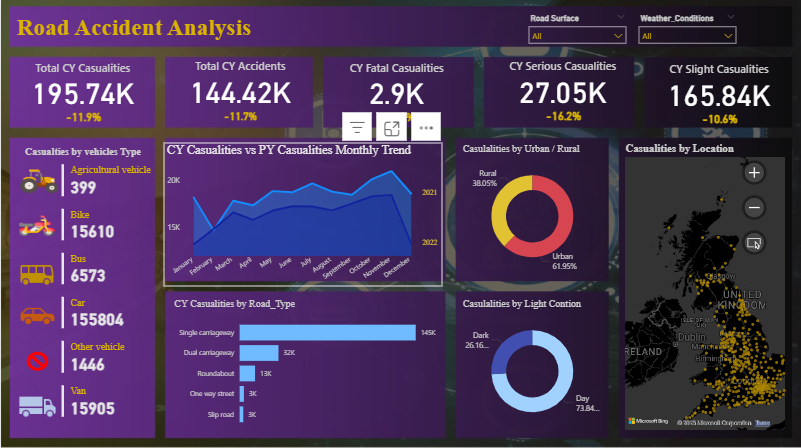

# 🚦 Road Accident Analysis Dashboard (Power BI)

## 📌 Overview
This project analyzes road accident data to identify patterns, severity trends, and high-risk locations.  
Using Excel for data preparation and Power BI for modeling and visualization, I built an interactive dashboard to monitor key metrics and generate actionable safety insights.

---

## 🎯 Objectives
- Analyze accident frequency and severity
- Identify accident-prone locations (hotspots)
- Track monthly and yearly trends
- Understand impact of road and light conditions
- Provide insights to support road safety planning

---

## 🛠️ Tools & Technologies
- Power BI
- Power Query
- DAX
- Microsoft Excel
- Data Modeling
- Data Visualization

---

## 🔍 Key Steps
1. Cleaned and transformed raw datasets using Excel & Power Query
2. Created data models and relationships in Power BI
3. Developed DAX measures for KPIs and calculations
4. Designed interactive dashboards with slicers and filters
5. Visualized trends, locations, and severity metrics

---

## 📊 Key Metrics (KPIs)
- Total Accidents
- Total Casualties
- Severity Distribution (Fatal/Serious/Slight)
- Urban vs Rural Analysis
- Monthly Trends
- Road & Light Condition Analysis

---

## 🔍 Key Insights
- Identified high-risk accident hotspots and locations
- Observed peak accident months and time periods
- Found higher accident concentration in urban areas
- Highlighted environmental and road factors influencing severity

---

## 🚀 Impact
The dashboard enables quick monitoring of accident trends and supports data-driven decisions for improving road safety measures, resource allocation, and planning.

---

## 📊 Dashboard Preview

